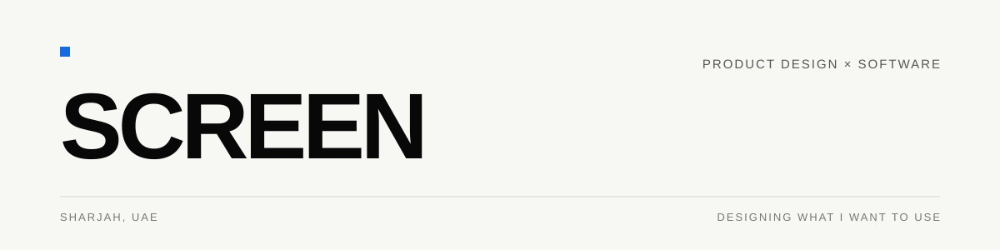
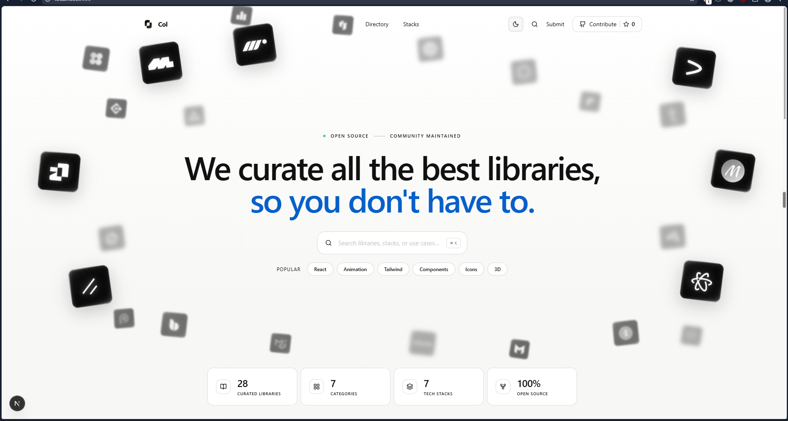
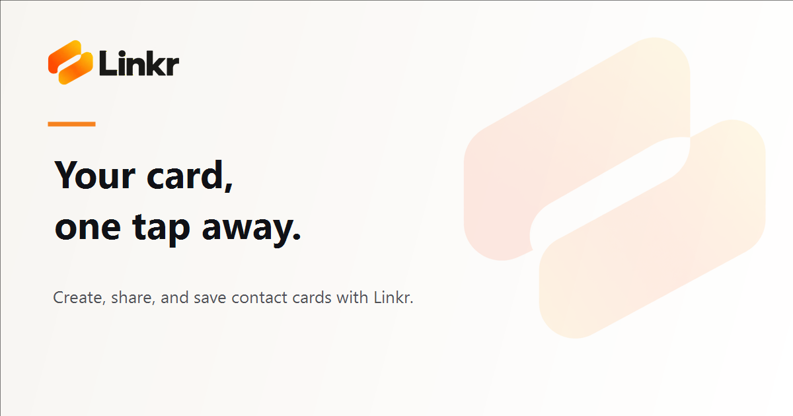
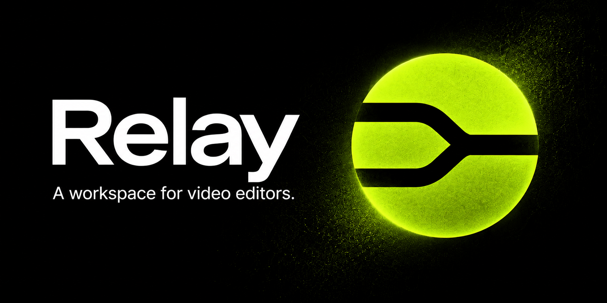

<picture>
  <source media="(prefers-color-scheme: dark)" srcset="./assets/profile-dark.svg">
  <source media="(prefers-color-scheme: light)" srcset="./assets/profile-light.svg">
  
</picture>

I design and build focused software for people who care how their tools feel.
Solo product designer and developer working across web and desktop from Sharjah.

[Portfolio ↗](https://znsnexus.com) &nbsp;&middot;&nbsp; [Elsewhere ↗](https://zaid.us.ci)

### Selected work

### [Col ↗](https://github.com/screen-gd/Col)

A curated place to discover and compare modern UI libraries.

### [Linkr ↗](https://linkrr-jet.vercel.app)

A digital contact card for creating, sharing, and keeping the people you meet.

### [Relay ↗](https://relay-app.cc.cd)

A focused production workspace for solo video editors and small teams.

TypeScript &middot; Next.js &middot; Electron &middot; Rust
